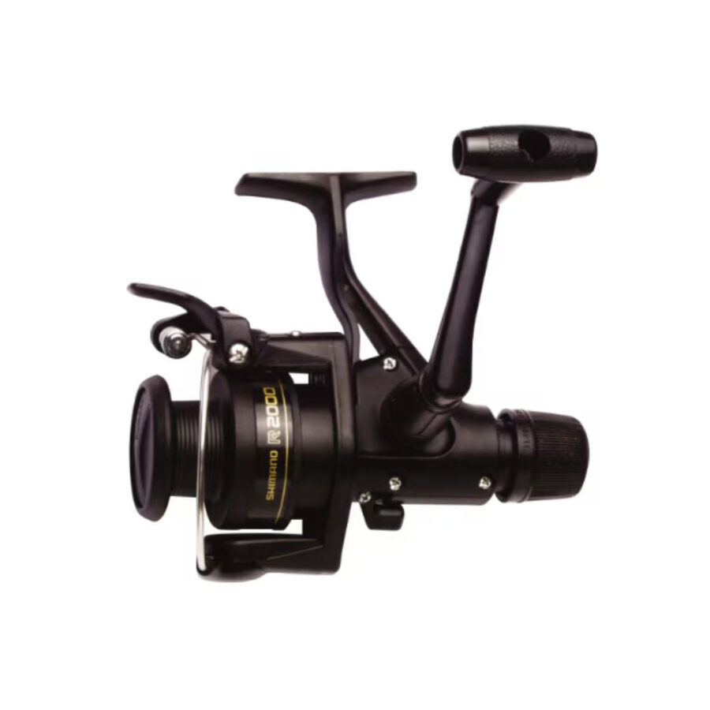
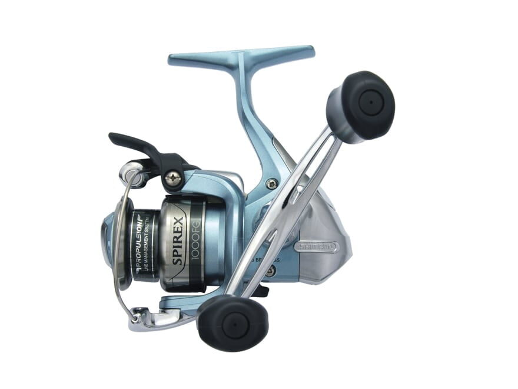
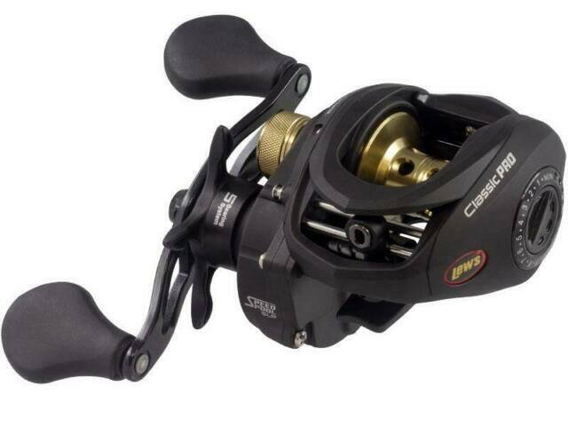
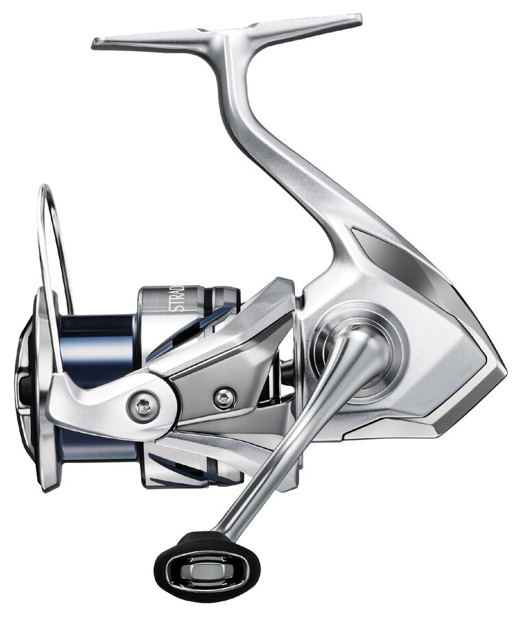

# Deal_Watch — Reel Images

Reference image catalog for owned reels. Images are mirrored into this repository under `assets/reels/` so the inventory does not depend only on external hotlinks.

## Shimano IX 2000 rear-drag spinning reel

- Inventory item: `Shimano IX 2000 rear-drag spinning reel`
- Repository image: `assets/reels/shimano-ix-2000r.jpg`
- Source page: https://miasangling.co.za/products/shimano-ix-2000r-reel
- Notes: Reference image for confirmed 2000-class Shimano IX rear-drag reel.

## Shimano Spirex 1000-class spinning reel

- Inventory item: `Shimano Spirex 1000-class spinning reel`
- Repository image: `assets/reels/shimano-spirex-1000fg.jpg`
- Source page: https://www.walmart.com/ip/15550361
- Notes: User-provided image also visually confirmed Shimano Spirex 1000 styling/marking in this chat. Repository image is a reference image for the same family until exact submodel is confirmed.

## Lew's Classic Pro Speed Spool SLP baitcast reel

- Inventory item: `Lew's Classic Pro Speed Spool SLP baitcast reel`
- Repository image: `assets/reels/lews-classic-pro-speed-spool-slp.jpg`
- Source page: https://www.ebay.com/p/5034620930
- Notes: Reference image for Lew's Classic Pro Speed Spool SLP family; exact left-hand `CP1SHL` variant still needs confirmation.

## Shimano Stradic FM 1000HG / ST1000HGFM class

- Inventory item: `Shimano Stradic 1000HG / ST1000HGFM class`
- Repository image: `assets/reels/shimano-stradic-fm-1000hg.jpg`
- Source page: https://findit.com.au/fishing-and-outdoor-store-en/shimano-stradic-fm/
- Notes: Reference image for owned Stradic 1000HG / `ST1000HGFM` class reel.

## Binary Image Mirroring Status

DONE. Current reel reference images are mirrored into GitHub under `assets/reels/`. Preserve the source links above as attribution and provenance.
